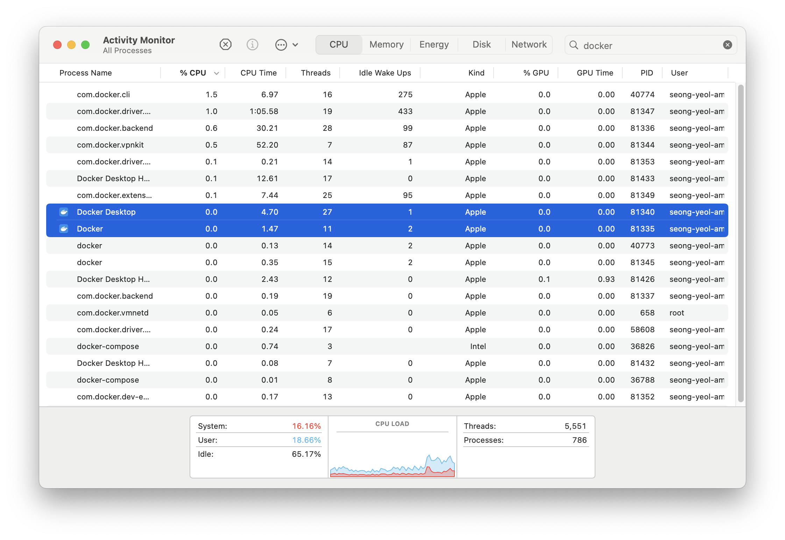
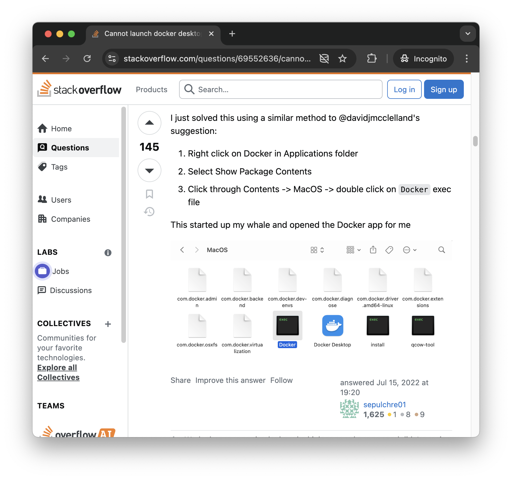
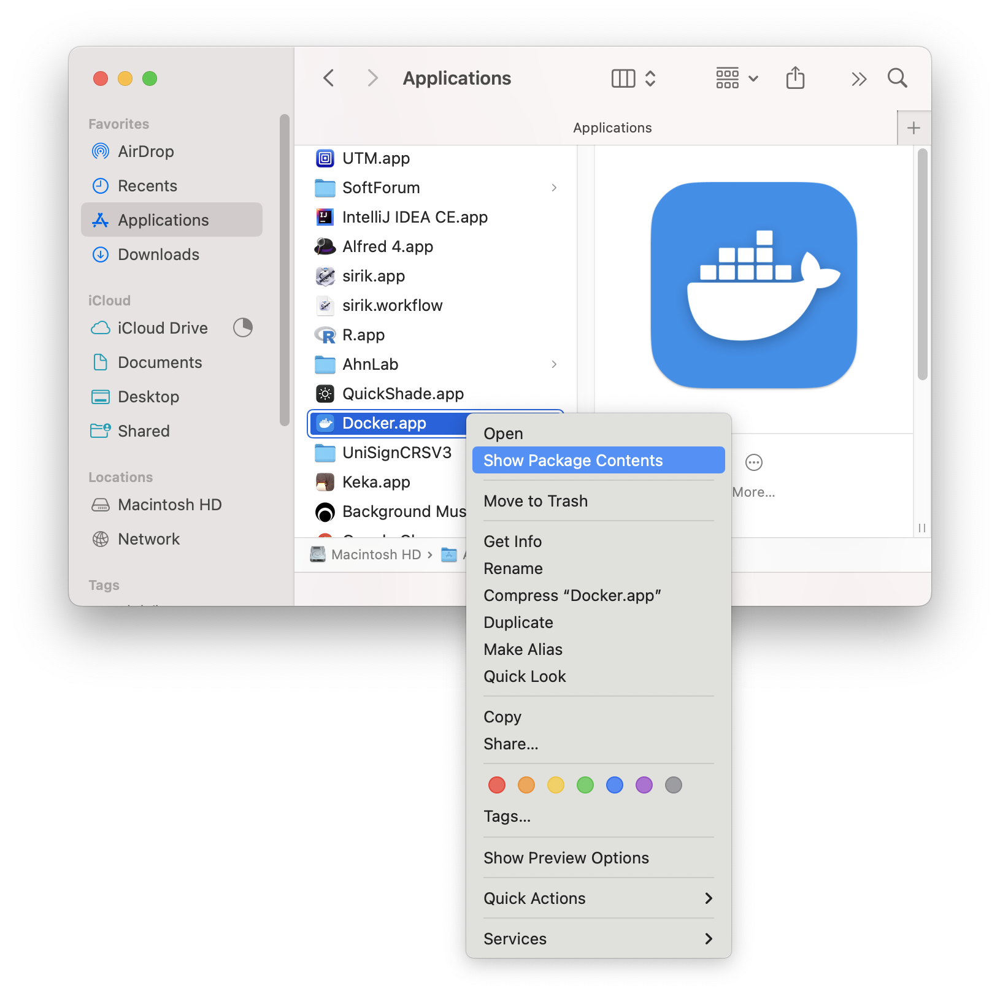
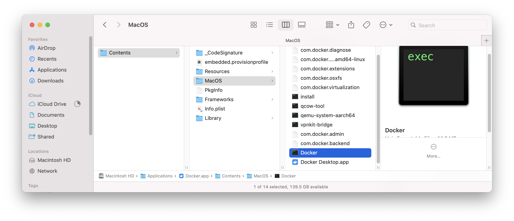
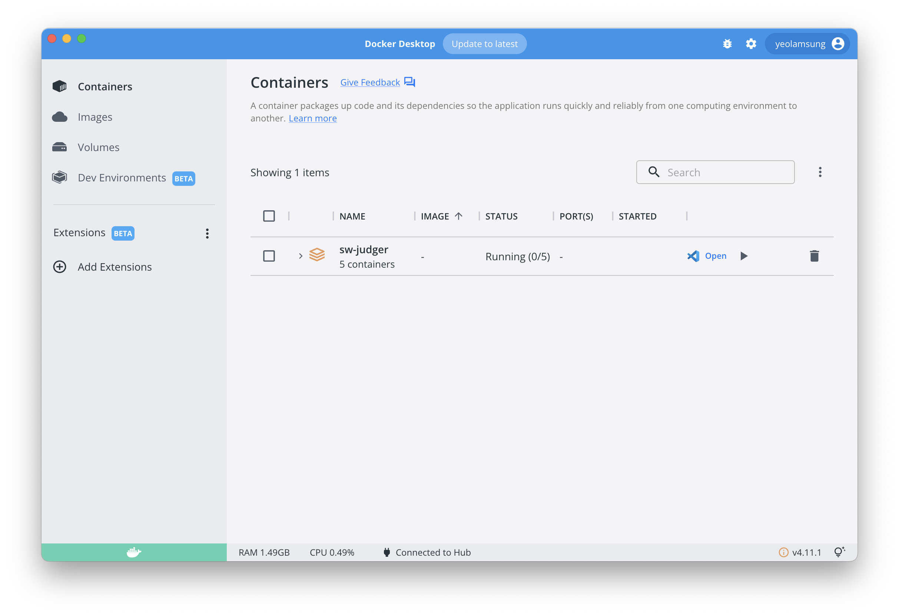
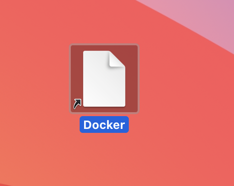

맥북으로 `macOS`를 2년 가까이 사용해오며, 개발 환경을 사용하는 과정에서 다양한 시행착오가 있었고, 이번에 소개드릴 `Docker` 또한 그중 하나이다.

시작은 현재 로컬 개발 기기인 맥북(`m1 pro`)에 도커를 설치한 후부터 시스템을 재시작(`restart`) 하고 처음에만 `Docker Desktop` 프로그램이 정상적으로 실행되고, 이후에 해당 프로그램을 잠시 종료(`Command(⌘) + W`)한 후, 다시 실행시키려할 때 도커 데스크탑 프로그램의 GUI 윈도우가 아예 표시되지 않는 것이다.

분명 `Docker` 및 `Docker Desktop` 프로세스는 계속 실행 중이었다.

{: width="600"}

 

`Activity Monitor`에서 `Docker`를 강제적으로 종료해야만 다시 프로그램이 실행되는 것을 확인하였다. 하지만 이 작업을 매번 반복할 수는 없지 않은가..

{: width="300"}

 

그래서 근본적인 해결 방법을 찾고자 하였다.

위와 같은 문제를 겪고 있는 다른 이들이 있을 것 같아, 구글링 해 보았고, 결과적으로 하단의 **스택오버플로우** 게시글을 발견하게 된다.

## 문제와 해결 방법이 기술된 게시글

- [https://stackoverflow.com/questions/69552636/cannot-launch-docker-desktop-for-mac](https://stackoverflow.com/questions/69552636/cannot-launch-docker-desktop-for-mac)

{: width="600"}

 

필자는 **두 번째 솔루션**을 채택하였는데, **첫 번째 솔루션**으로는 해결이 되지 않았고, 기존 로컬 스토리지에 저장되어 있던 도커 데이터를 삭제해야 된다는 단점이 있었다.

**두 번째 솔루션**의 단계를 정리하면 다음과 같다.

## Solution

1. `Applications` 디렉토리 내에서 `Docker`를 찾은 후, `Show Package Contents`를 클릭한다.

   > 필자는 시스템 언어가 `영어`로 설정되어 있기에 `한글`에서는 다르게 표시될 수 있을 것 같다.

{: width="600"}

 

2. `Show Package Contents` 버튼을 클릭하여 열린 `Finder` 경로에서 `Contents` → `MacOs` → `Docker` 실행 파일을 확인 후, 이를 실행해 보면 하단과 같이 정상적으로 프로그램이 실행되는 것을 확인할 수 있다.

{: width="600"}

{: width="600"}

 

결과적으로, 위 방법 또한 매번 해당 경로까지 이동하여 `Docker` 실행 파일을 실행하는 것은 비효율적이므로 바탕화면에 `바로가기` 아이콘으로 두는 것이 좋을 것 같다.

> `Option(⌥) + Command(⌘)` + `마우스 드래그` 방법으로 바로가기 아이콘 생성이 가능하다.

{: width="300"}
