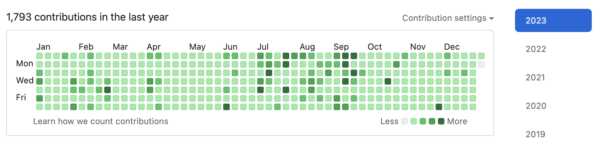
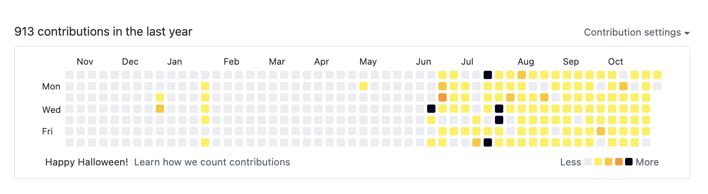

1년간 잔디를 심어오며 깃헙 잔디색이 다양하다는 사실을 알게 되었다. 그렇다면, 색이 변화하는 순간은 언제일까?

# 🌱 잔디심기

## 2023년

<figcaption>제법 빽빽한 잔디밭이 되었다..</figcaption>

깃헙을 오랜 기간 사용해오며, 잔디를 심을 수 있는 방법이 다양함을 알게 되었다.

- **커밋(Commit)하기**
  > 가장 일반적인 방법으로 **저장소**(Repository)에서 **기본**(Default)이 되는 브랜치 내에서 작업 후 **커밋**(Commit)을 추가하여, Push까지 완료하면 자동으로 잔디로 반영된다.
- **저장소(Repository) 생성하기**
  > 개인 깃헙 계정 혹은 **Owner**로 권한으로 소속되어 있는 조직(Organiation)에서 신규 저장소 생성 시 잔디로 반영된다.
- **이슈(Issue) 생성하기**
  > 저장소 메뉴바에 있는 **Issues** 클릭 후 **`New issue`** 버튼을 클릭하여 신규 이슈를 생성하면 잔디로 반영된다.
- **PR(Pull Request) 생성하기**
  > 저장소 내에서 작업한 브랜치에 대하여 **PR**을 생성할 시 잔디로 반영된다.
- **코드 리뷰(Review)하기**
  > PR페이지에서 리뷰 준비된 커밋에 대하여 리뷰 코멘트(Comment) 작성 시 잔디로 반영된다.
- **병합(Merge)하기**

  > PR에 대한 기본(Default) 브랜치로 병합이 완료되면, 병합한 사용자의 잔디로 반영된다.

대략 위 6가지 정도의 방법이 있는 것으로 알고 있다.

 

## 🎃 2022년 10월 31일(할로윈, Halloween)

  <figcaption>할로윈의 테마 컬러인 노란색 계열의 잔디들</figcaption>

잔디 심기를 본격적으로 해보자고 다짐한 2022년 3분기 이후에 처음으로 깃헙 잔디색이 변한다는 사실을 알게된 순간이었다. 당시에는 신년이나 다른 날에도 바뀌는 걸까? 하는 궁금점을 갖게 되었다.

 

## ⛄️ 2022년 12월 21일(크리스마스, Christmas)

<figcaption>겨울 테마의 푸른 컬러의 잔디들.. 꽤 예쁘다 ❄️</figcaption>

2023년 할로윈데이 때에는 지난 해와 동일하게 잔디색이 바뀐 것으로 얼핏 기억하는데, 이번 크리스마스 시즌에는 작년과 다르게 변화점이 없어서 푸른 잔디밭 세상(?)을 기대한 나로서는 다소 아쉬웠다.

 

**그러나, 2023년의 잔디밭은 순풍으로 잠잠했다.....**

<figcaption>아쉬움을 감추지 못 하는 모습..</figcaption>

지난 모든 날들이 유의미한 기여는 아니었지만, 내가 개발자라는 사실을 상기시켜줄 수 있다는 것이 잔디심기가 지니는 또 하나의 가치라고 여긴다.

🌱 잔디심기는 내년에도 멈추지 않을 것이니 이후에 추가되는 내용이 있으면 기록해 보기로 하자.
