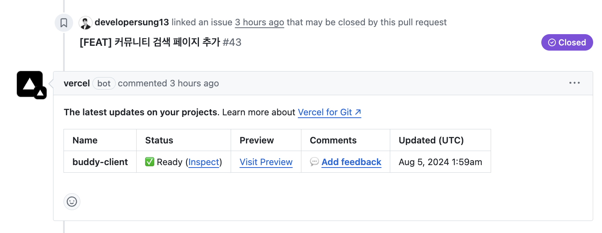
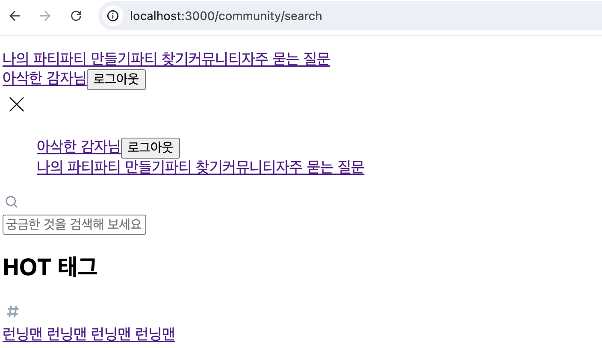

현재 교내 `오픈소스SW 동아리` 프로젝트의 일환으로 **버디`(공동 구독 플랫폼)`** 구축을 위한 웹
서비스를 개발 중이다.

웹 프론트엔드 개발의 경우 `Next.js` 14.1.3 버전의 프레임워크를 사용 중인데,
프로젝트의 형상 관리를 위해 `GitHub`을 사용 중이고, 서비스 홈페이지 임시 배포를 위해 Next.js 프레임워크를 개발한 `Vercel` 클라우드 플랫폼을 이용 중이다.

프로젝트 레포에서 작업이 완료된 브랜치에 대하여 PR를 생성한 경우 하단의 [사진](#vercel-bot-image)과 같이, `vercel (bot)`이 작업 브랜치에 대하여 빌드부터 배포까지의 일련의 작업을 자동으로 진행해 주기 때문에 필자는 Next.js 프로젝트에서 매우 빈번하게 사용한다.

<a name="vercel-bot-image"></a>
{: width="800"}

따라서 PR을 생성하기 이전에 로컬 환경에서 프로젝트를 미리 빌드해 보는데, 어째선가 하단의 [이미지](#about)와 같이
**CSS가 홈페이지 전반에 걸쳐 갑작스레 적용되지 않는 것이다**. 🫨

<a name="about"></a>
{: width="600"}

## 빌드 시 사용한 명령어

```sh
yarn run build
```

**CSS**는 현재 프로젝트에서 `global.css`, `tailwindCSS`, `inline style`을 사용 중인데, 모두 적용되지 않았고, 프로젝트를 처음 실행시킨 후에만 로드되었으며, **HMR**이 사용되는 즉시 페이지의 CSS 적용이 취소되는 것이었다.

이슈의 발생 시점을 상기해 보았을 때 PR을 위해 로컬 환경에서 미리 프로젝트를 빌드한 후로부터 문제가 발생되었다는 사실을 알게 되었다.

그래서 빌드 과정에서 생성된 `.next` 디렉토리 내 여러 빌드 파일 및 캐시와, 기존의 프로젝트 실행 과정에서 존재하던 `.next` 디렉토리 간에 문제가 생겨 이와 같은 CSS 깨짐이 발생하였다는 생각이 들었기에 `yarn run build` 명령어를 통해 생성된 프로젝트의 루트 디렉토리에 존재하는 `.next` 디렉토리를 하단의 명령어로 제거한 후 `yarn run dev` 명령어로 프로젝트를 다시 실행해 보니 **[정상적으로 CSS가 적용](#css-success-applied)**되는 것을 확인할 수 있었다.

## `build`를 통해 생성된 `.next` 디렉토리를 제거

```sh
rm -rf .next # 프로젝트의 루트 디렉토리에서 명령 입력
yarn run dev # 또는 npm run dev 명령으로 개발 서버 실행
```

<br />

<a name="css-success-applied"></a>
{: width="600"}

<figcaption>성공적으로 CSS가 적용된 상태 😎</figcaption>

<br />

## My memo

`Next.js`를 지난 1년 간, 메인으로 사용하고 있지만 내가 알고 있다고 생각하는 부분은 여전히 빙산의 일각이라고 느껴진다.

도구를 사용하는 방법을 제대로 익혀야 그만큼 좋은 결과물이 만들어지지 않는가. 기술의 발전이 멈추지 않는 만큼 필자 또한 학습을 멈추지 않을 것이다.
