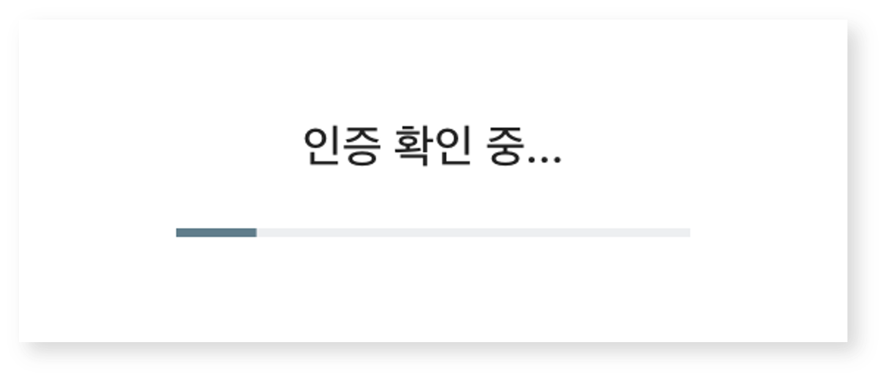
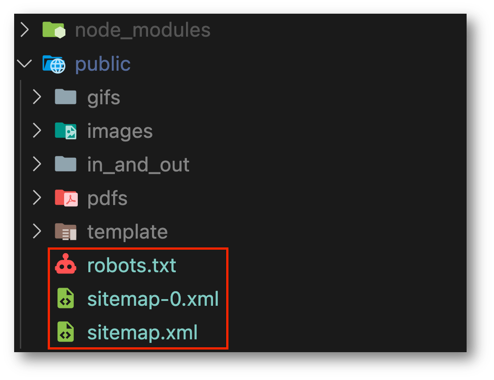

Next.js로 프로젝트를 개발했다면, `Vercel`과 같은 클라우드 플랫폼에 도메인 배포 후, 외부 사용자들이 구글이나 네이버 검색을 통해 해당 사이트를 조회하고, 쉽게 접근할 수 있도록 잘 노출시키는 것이 중요하다.

이번 게시글의 목적은 Next.js으로 개발된 웹 서비스를 **구글(Google)** 검색에 제대로 노출시킬 수 있도록 하는 것이다. 따라서 이하의 내용은 **배포가 선행되었음을 가정하고 진행한다**.

## 시작하기

- **[Google Search Console](https://search.google.com/search-console/about){:target="\_blank"}**에 접속하여 `시작하기` 버튼을 클릭한다.

{: width="100%"}

<br />

- 이동된 페이지 내에는 `속성 유형`을 선택할 수 있는데, **URL 접두어**를 선택하고, URL 입력란에 등록하고자 하는 서비스의 URL를 입력한 후 `계속` 버튼을 클릭한다.
  > e.g., https://example.vercel.app

{: width="100%"}

- 3초 이내의 짧은 인증 확인을 거치면, `소유권 확인` 창이 표시되는데, 이곳에서 **HTML 태그**를 클릭한 후, `복사` 버튼을 클릭하여 meta 태그 복사한다.

{: width="300"}
{: width="80%"}

- 복사한 meta 태그를 Next.js 프로젝트의 루트 `layout.tsx` 파일 내 `<head>...</head>` 사이에 추가한다.

## 방법 #1

```tsx
export default function RootLayout({
  children,
}: {
  children: React.ReactNode;
}) {
  return (
    <html lang='en'>
      <head>
        <link rel='icon' href='/images/cube-logo.png' />
        /* 이곳에 붙여넣기 */
        <meta
          name='google-site-verification'
          content='isENqoS-vEJn7rno17EZWfhCbHez5XsiJAMitll0aE4'
        />
      </head>
      <body className='text-sm'>...</body>
    </html>
  );
}
```

<br />

나아가 검색 결과로 노출 시에 **서비스에 대한 구체적인 설명을 추가하려면**, 하단과 같이 `metadata`를 수정하면 된다.
그리고, meta 태그를 직접 추가하는 방법 대신 `metadata` 객체 내에서 `verification` 항목을 추가하여 관리하는 방법도 가능하다.

위 방법의 장점은 `네이버 서치어드바이저` 같은 타검색 엔진 최적화 도구에 개발한 서비스를 추가적으로 등록할 때 객체로써 직관적 관리가 가능하다는 점이라 생각한다.

## 방법 #2

```tsx
export const metadata = {
  title: '서비스명',
  description: '이 서비스는 ~~~~~~를 목표로 합니다',
  keywords: ['example', '성열암', '블로그', '성열암 블로그', '개발 블로그'],
  authors: [{ name: '성열암', url: 'https://example.vercel.com/' }],
  openGraph: {
    title: '서비스명 - 성열암',
    description: '이 서비스는 ~~~~~~를 목표로 합니다',
    url: 'https://example.vercel.com/',
    siteName: 'Example',
    images: [
      {
        url: 'https://example/images/cube-logo.png',
        width: 800,
        height: 600,
        alt: '서비스 로고',
      },
    ],
    locale: 'ko_KR',
    type: 'website',
  },
  verification: {
    /* google의 value로써 복사했던 meta 태그 내 content 속성 값을 이곳에 붙여넣기 */
    google: 'is~~~~~~~~~~~여기에 붙여넣기~~~~~~~~~~~~~~',
    other: {
      'naver-site-verification': 'naver search advisor 인증 코드 입력란',
    },
  },
};
```

<br />

- 복사한 내용을 위 방법 1~2 중에 하나를 선택하여 완료한 후, 웹 애플리케이션 빌드 시에 `sitemap.xml` 파일 자동으로 생성하기 위해 `next.config.js` 파일을 아래와 같이 수정한다.

```js
/** @type {import('next').NextConfig} */

const withBundleAnalyzer = require('@next/bundle-analyzer')({
  enabled: process.env.ANALYZE === 'true',
});

const nextConfig = { ... };

module.exports = withBundleAnalyzer(nextConfig);
```

<br />

- SEO 최적화와 검색 엔진 크롤링 효율화 설정, 그리고 `robots.txt` 파일을 자동으로 생성하기 위해 프로젝트 루트 디렉토리 내 `next-sitemap.config.js` 파일을 추가한다.

```js
/** @type {import('next-sitemap').IConfig} */
const config = {
  siteUrl: process.env.NEXT_PUBLIC_SITE_URL, // 사이트의 기본 URL
  generateRobotsTxt: true, // robots.txt 파일 생성 여부
  sitemapSize: 7000, // 각 sitemap의 최대 URL 수
  changefreq: 'daily', // 검색 엔진에 대한 URL 업데이트 빈도
  priority: 0.7, // 기본 URL 우선 순위
  // exclude는 sitemap.xml 생성 시 제외할 URL를 포함 (e.g., private page)
  exclude: [
    '*/register*', // 'register'가 포함된 모든 경로 제외
    '*/edit*', // 'edit'이 포함된 모든 경로 제외
    '*/mypage*', // 'mypage'이 포함된 모든 경로 제외
  ],
};

module.exports = config;
```

- 위 설정을 모두 마쳤다면, 터미널에서 하단의 명령어를 통해 Next.js 프로젝트를 빌드한다. 그럼 빌드 결과의 마지막 로그로 SITEMAP 생성에 대한 확인이 가능하다.

```sh
npm run build # 또는 yarn build
```

{: width="80%"}

<figcaption>(예시 이미지)</figcaption>

- 생성된 `robots.txt`, `sitemap.xml` 파일은 `/public` 경로에 존재한다.

> `sitemap-0.yml`과 같이 숫자가 붙은 sitemap 파일은 사이트맵 분할 기능에 의해 생성된 분할된 사이트맵 파일 중 하나이다.

{: width="60%"}

- 이제 추가한 내용들을 서비스 배포 버전에 포함시킨 후에 이전의 `소유권 확인` 창에서 HTML 태그 섹션 우측 하단의 **확인** 버튼을 누른다.

{: width="300"}

<br />

- `소유권 확인`이 정상적으로 완료되면, 하단과 같이 확인 창이 표시된다.

{: width="60%"}

<br />

- 이후에 Google Search Console 관리 페이지로 리디렉션되면, 좌측의 사이드 메뉴에서 **Sitemaps** 탭을 클릭하여 이전에 프로젝트를 빌드하며 생성된 `sitemap-0.xml` 파일을 등록한다.
  > `sitemap.xml` 파일이 아닌 이유는 실질적인 urlset 데이터가 포함된 파일은 `sitemap-0.xml` 파일이기 때문이다.

{: width="80%"}
{: width="80%"}
{: width="80%"}

<br />

- 사이트맵 제출까지 완료했다면, `개요` 탭에서 데이터 처리에 대한 상태를 확인할 수 있다.

{: width="80%"}

<br />

- 구체적인 처리 기간은 알기 어렵지만, 필자의 경우 2~3일 정도 경과 후, 하단과 같은 실제 데이터를 확인할 수 있었다.

{: width="80%"}

<br />

- 위의 모든 과정이 진행되었다면, `Chrome` 웹 브라우저 **시크릿 모드**에서 구글 검색을 진행했을 떄 실제 서비스가 검색 결과에 성공적으로 노출된다.

{: width="80%"}

<figcaption>(위 방법으로 등록했던 웹 서비스)</figcaption>

<br />

이렇게 다른 서비스 및 개인 개발 블로그의 포스트 또한 구글 검색에 노출시킬 수 있다.

{: width="80%"}

<br />

여담으로.. 대학 후배 중 한 분께서 검색 중에 우연히 위 게시글을 접해 신기했다는 연락을 주어 이렇게 게시글로 작성하게 되었다.

velog나 티스토리의 경우 게시글 작성 시 자동으로 구글에서 크롤링되는 것으로 알고 있지만, 일반적인 웹 페이지의 경우에는 그렇지 않으므로, 위와 같은 등록 절차가 있어야 구글과 같은 검색 엔진에 서비스를 노출시킬 수 있는 것 같다.

서비스를 잘 만드는 것과 더불어 잘 홍보하는 것 또한 매우 중요한 과정이므로, 개발했던 여러 서비스들을 한번 등록해 보길 바란다.
