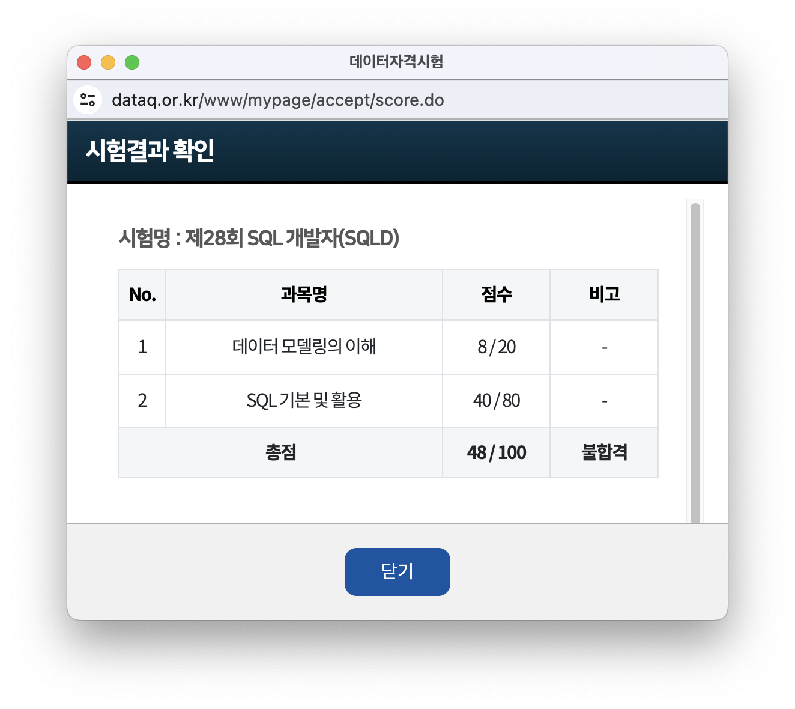
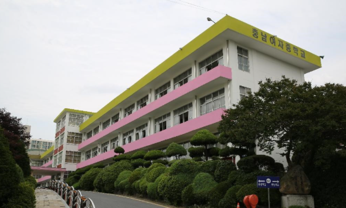
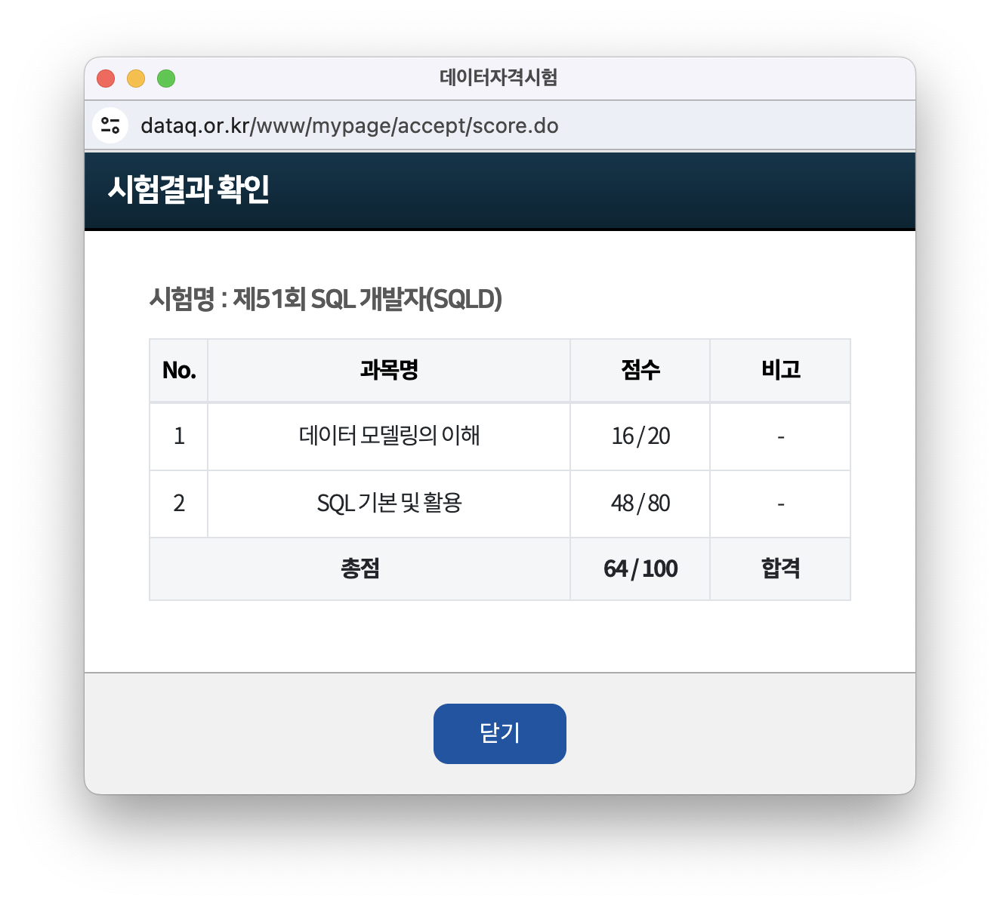

지난달에 [한국데이터산업진흥원에서](https://www.dataq.or.kr/www/main.do){:target="\_blank"} 주관하는 **제51회 [SQL 개발자(SQLD)](https://www.dataq.or.kr/www/sub/a_04.do){:target="\_blank"}시험**을 치르고 왔다.

18년도에 이미 한 번 응시한 경험이 있어서 이번만큼은 기필코 붙어야만 했다. 공식 학습 교재의 가격도 한몫 했다고 볼 수 있다.

# 첫 시험

## 📝 제28회 SQL 개발자(SQLD)

첫 시험 당시에는 고등학교 방학 기간을 이용하여, 한 달 정도 공부하였는데, 아무래도 SQL 기술을 실제로 응용하여 비즈니스 로직에 적용해 본 경험이 많이 부족하여

**SQL 전문가 가이드** 책에서만 본 내용들을 단순히 Workbench 프로그램에서 실습해 본 것이 전부였다.

시험은 충남대학교 정문 입구에 가까이 있는 공과대학 2호관에서 응시하였다. 실제 고사장에 도착했을 때 응시자 대부분이 대학생 혹은 회사원이었던 것 같다.

{: width="600"}

<figcaption>첫 SQLD 고사장..</figcaption>

그렇게 총 **2개의 과목**(`데이터 모델링의 이해`, `SQL 기본 및 활용`)을 풀고 시험지와 답안지 검토를 두 번 정도 진행하니 시험이 종료되었다. 이후 가채점은 하지 않았지만, 느낌이 좋았다. 대부분 1~2주 정도 공부하고 합격하는 시험이라고 하여 한 달 가까이 공부한 나는 합격의 기분이 느껴진 것이다..

{: width="600"}

당차게 실패해 버렸다.

{: width="300"}

<figcaption>일주일 공부한 정도의 점수랄까..?</figcaption>

시험 응시료가 5만 원 정도 되니 **SQL 전문가 가이드**, **SQL 자격검정 실전문제** 교재를 함께 구입했을 때 대략 12만 원 정도 들었던 것 같다. 학생의 코 묻은 돈으로 준비한 시험이었지만, 돈과 시간을 많이 쓴 것 같다는 생각이 들었고, 나중에 시간이 된다면 반드시 합격해야 했다고 다짐했다.

# 마지막 시험

## 📝 제51회 SQL 개발자(SQLD)

첫 시험으로부터 5년이라는 시간이 흐르고, 대학에서 **데이터베이스시스템**이라는 DB 이론 및 실기 학습을 다루는 교과목을 수강하게 됐고, 담당 교수님께서 11월 SQLD 시험에 응시해 보는 것을 권하였고, 이번에는 반드시 합격하겠다는 생각으로 수업에 열심히 임했던 것 같다.

응시 1주일 전에 SQL 자격검정 실전 문제집을 다시 구매하여 열심히 풀었는데, 글을 쓰는 지금 비교해 보니 이게 웬 걸.. 18년도 발행 판과 내용이 같은 것이 아니더냐....

{: width="300"}

<figcaption>같은 책을 두 권 산 것이다.. 나란 녀석,,</figcaption>

새 책이라 첫 시험 당시 공부하며 메모했던 내용들이 없어서 좀 더 집중하여 공부하게 된 좋은 면도 있는 것 같다.

시험 시작 4시간 전에 아슬아슬하게 1회 독을 마치고,, 고사장이었던 대전 충남여자중학교로 이동하여 시험을 마무리하였다.

{: width="600"}

<figcaption>몸이 얼만큼 추운 날씨...❄️</figcaption>

시험에 출제된 문제들을 되짚어 보면 다음과 같다.

### 1과목(데이터 모델링의 이해)

- 업무에서 필요로 하는 인스턴스에서 관리하고자 하는 의미상 더 이상 분리되지 않는 최소의 데이터 단위를 무엇이라 하는가? (단답형)
  > 정답: 속성(Attribute)
- 다음 중 비식별자 관계로 연결하는 것을 고려해야 하는 경우로 가장 적절한 것은?(객관식)

- 주식별자의 특징으로 올바른 것을 고르시오(객관식)

- 그림으로 주어진 엔티티의 관계를 올바르게 설명한 것은?(객관식)

### 2과목(SQL 기본 및 활용)

- `NTILE` 함수의 결과로 올바른 문항을 선택하는 문제(객관식)

- 쿼리문 결과를 알려주고 구성 쿼리 빈칸에 `ROLLUP`, `CUBE`, `GROUPING SETS` 중에서 어떤 것을 쓰는 게 올바른 것인지 고르는 문제(객관식)

- `FLOOR(-3.5)`의 반환 값을 작성하시오(단답형)
  > 정답: -4

그 외 문제 복원은 **[데이터 전문가 포럼(DP Forum)](https://cafe.naver.com/sqlpd){:target="\_blank"}** 카페를 참고하면, 지난 시험 정보까지 좀 더 확인해 볼 수 있으니 시험을 앞두신 분들이라면 알아두면 좋을 것 같다.

> 시험 직전에 카페 게시글에 나와 있던 문제가 그대로 출제된다고 들어서 기출 문제 학습을 완료하신 분들이 함께 보면 큰 도움이 될 것이다.

시험일로부터 한 달 후 한창 기말고사가 진행되던 12월 15일에 시험 결과가 공개되었다.

{: width="600"}

턱걸이 합격이다. 첫 시험으로부터 5년 만에 다시 본 시험이었지만, 그동안 여러 토이 프로젝트 개발 및 졸업작품을 끝낸 덕에 데이터베이스 CRUD 및 기본 개념들을 익히게 되어 이번 시험을 준비하는 과정 중에는 가이드북을 참고하지 않고 실전 문제집으로 공부하여 합격할 수 있었던 것 같다.

 

만약 **관계형 데이터베이스 관리 시스템(RDBMS)**에 대한 개념과 활용 경험이 없다면, 유튜브나 학습 플랫폼을 통하여 인터넷 강의를 먼저 접하여 개념을 잡은 후, 공부하는 것이 더욱 효과적이라는 생각이 이번 SQLD 시험을 치르며 느끼게 되었고, 난도가 높은 시험은 아니니 관련 학습 배경이 없더라도 SQL 학습을 심도 있게 한다면, 원활히 통과할 수 있을 것 같다.

 
 

{: width="250"}

<figcaption>모두 합격하자!!</figcaption>
